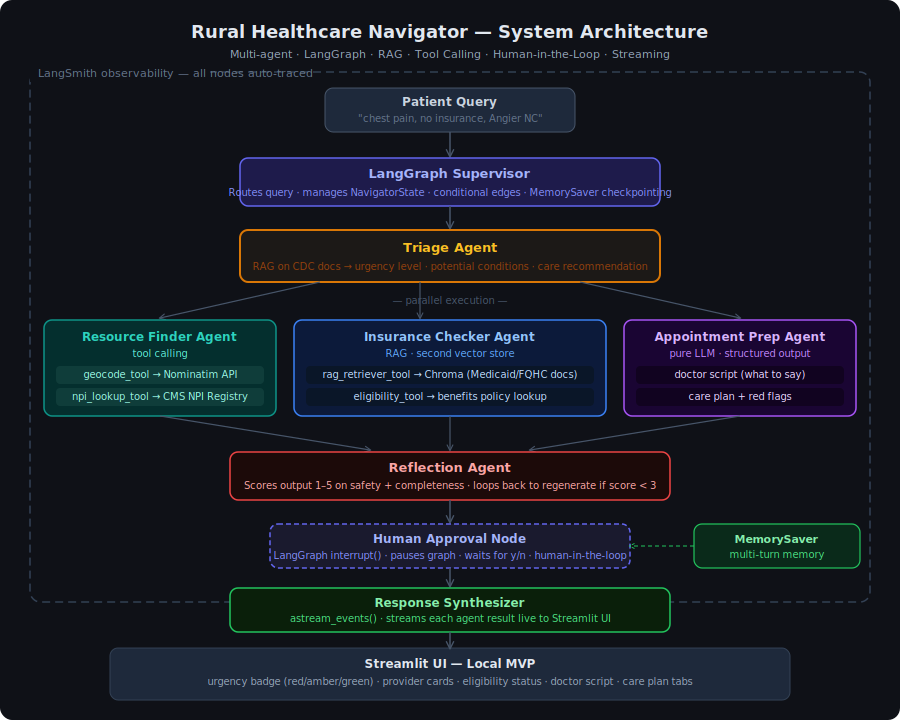

# 🏥 Rural Healthcare Navigator

> An AI-powered multi-agent system that helps rural patients understand symptoms, find nearby providers, check insurance eligibility, and prepare for doctor visits — all running locally.

[](https://python.org)
[](https://github.com/langchain-ai/langgraph)
[](https://langchain.com)
[](https://trychroma.com)
[](https://streamlit.io)
[](https://smith.langchain.com)

---

## Architecture



> **Download:** [architecture.svg](architecture.svg)

The system is a **supervisor + specialized workers** multi-agent architecture orchestrated by LangGraph. A supervisor node routes the patient query through a state graph, invoking specialized agents in parallel, with a reflection loop and human-in-the-loop approval before the final response is streamed to the UI.

### Agent flow

```
Patient Query
      │
      ▼
LangGraph Supervisor  ←── MemorySaver (multi-turn memory)
      │
      ▼
Triage Agent  ★ (your existing RAG on CDC docs)
      │  urgency · conditions · recommendation written to NavigatorState
      │
      ├──────────────────┬──────────────────┐
      ▼                  ▼                  ▼
Resource Finder    Insurance Checker   Appointment Prep
(tool calling)     (RAG pipeline 2)    (structured LLM output)
Nominatim + NPI    Medicaid/FQHC docs  doctor script + care plan
      │                  │                  │
      └──────────────────┴──────────────────┘
                         │
                         ▼
                 Reflection Agent
           scores 1–5 · loops back if < 3
                         │
                         ▼
              Human Approval Node
           LangGraph interrupt() · y/n
                         │
                         ▼
              Response Synthesizer
           astream_events() → Streamlit UI
```

---

## Technology Stack

| Layer | Technology | Purpose |
|---|---|---|
| **Orchestration** | [LangGraph](https://github.com/langchain-ai/langgraph) | State graph, supervisor routing, conditional edges, parallel agent execution, `interrupt()` for human-in-the-loop |
| **Agent framework** | [LangChain](https://langchain.com) | `AgentExecutor`, `@tool` decorator, `bind_tools()`, `with_structured_output()` |
| **LLM backend** | OpenAI GPT-4o / Ollama (local) | Powers all agents; swap via `ChatOpenAI` or `ChatOllama` |
| **Vector database** | [ChromaDB](https://trychroma.com) | Two local collections: CDC symptom docs (triage) and Medicaid/FQHC policy docs (insurance) |
| **Embeddings** | OpenAI `text-embedding-3-small` / `nomic-embed-text` (local) | Document and query embedding for RAG retrieval |
| **RAG pipeline** | LangChain `RetrievalQA` | Retrieves top-k chunks from Chroma, grounds agent answers in source documents |
| **Tool calling** | LangChain `@tool` + `bind_tools()` | Geocoding (Nominatim), NPI provider registry (CMS public API) |
| **Memory** | LangGraph `MemorySaver` | Persists `NavigatorState` across conversation turns via `thread_id` |
| **Observability** | [LangSmith](https://smith.langchain.com) | Auto-traces every node, tool call, and LLM invocation in the graph |
| **Streaming** | LangGraph `astream_events()` | Streams each agent result to the UI as it completes |
| **UI** | [Streamlit](https://streamlit.io) | Local web UI with urgency badge, provider cards, eligibility panel, doctor script |
| **External APIs** | Nominatim (geocoding, free) · CMS NPI Registry (provider lookup, free) | No API key required for MVP |

### State schema

Every agent reads from and writes to a shared `NavigatorState` TypedDict:

```python
class NavigatorState(TypedDict):
    query:           str          # original patient input
    thread_id:       str          # for MemorySaver multi-turn
    urgency:         str          # triage agent → "low" | "medium" | "high"
    conditions:      list[str]    # triage agent → potential conditions
    recommendation:  str          # triage agent → care recommendation
    resources:       list[dict]   # resource finder → nearby providers
    eligibility:     dict         # insurance checker → coverage options
    doctor_script:   str          # appointment prep → what to tell the doctor
    care_plan:       str          # appointment prep → immediate steps + red flags
    reflection_score: int         # reflection agent → 1–5 quality score
    approved:        bool         # human approval node → y/n
    final_response:  str          # synthesizer → plain-language output
```

---

## Prerequisites

- Python 3.11+
- `git`
- An OpenAI API key **or** [Ollama](https://ollama.ai) installed locally (for fully local, no-cost runs)
- A free [LangSmith](https://smith.langchain.com) account (optional but recommended)

---

## How to Run (MVP — fully local)

### 1. Clone the repo

```bash
git clone https://github.com/amohan601/rural-healthcare-navigator.git
cd rural-healthcare-navigator
```

### 2. Create and activate a virtual environment

```bash
python -m venv .venv
source .venv/bin/activate        # macOS/Linux
.venv\Scripts\activate           # Windows
```

### 3. Install dependencies

```bash
pip install -r requirements.txt
```

### 4. Configure environment variables

```bash
cp .env.example .env
```

Edit `.env`:

```env
# LLM — choose one
OPENAI_API_KEY=sk-...            # OpenAI (recommended for best results)
# OLLAMA_BASE_URL=http://localhost:11434   # uncomment for fully local Ollama

# LangSmith observability (free — get key at smith.langchain.com)
LANGCHAIN_TRACING_V2=true
LANGCHAIN_API_KEY=ls__...
LANGCHAIN_PROJECT=rural-healthcare-navigator

# Model names
LLM_MODEL=gpt-4o                 # or "llama3" for Ollama
EMBED_MODEL=text-embedding-3-small  # or "nomic-embed-text" for Ollama
```

### 5. Ingest documents into ChromaDB

This builds both vector stores — the CDC symptom collection (triage) and the Medicaid/FQHC policy collection (insurance checker). Only needs to run once.

```bash
python src/backend/ingest.py
```

Expected output:
```
[triage]    Ingested 47 chunks from 3 CDC documents → chroma/triage_store
[insurance] Ingested 62 chunks from 5 Medicaid/FQHC documents → chroma/insurance_store
Done.
```

### 6. Run via CLI

```bash
python src/backend/run.py "I have chest pain and no insurance, I live in Angier NC"
```

The graph executes with streaming output — you'll see each agent's result appear as it completes:

```
[triage]      urgency=HIGH · conditions=['cardiac event', 'angina'] · ...
[resources]   found 3 providers within 20 miles accepting Medicaid ...
[insurance]   Medicaid-likely eligible · nearest FQHC: Johnston Health ...
[prep]        "Tell your doctor: onset 2 hours ago, pressure in chest ..."
[reflection]  score=4 · output approved
[human]       Review plan above. Approve? (y/n): y
[response]    ✅ Final plan ready
```

### 7. Run the Streamlit UI

```bash
streamlit run src/frontend/app.py
```

Open [http://localhost:8501](http://localhost:8501) in your browser.

The UI shows:
- **Urgency badge** — color-coded red / amber / green
- **Provider cards** — name, distance, accepts Medicaid, phone
- **Eligibility panel** — coverage status and nearest sliding-scale options
- **Doctor script** — copyable bullet points of what to say
- **Care plan tab** — immediate actions, 48-hr follow-up, red flags

### 8. View traces in LangSmith (optional)

If you configured `LANGCHAIN_API_KEY`, every run is automatically traced. Visit [smith.langchain.com](https://smith.langchain.com), open the `rural-healthcare-navigator` project, and click any run to see:
- The full LangGraph state at each node
- Every tool call with inputs and outputs
- LLM latency and token usage per agent

---

## Project Structure

```
rural-healthcare-navigator/
├── src/
│   ├── backend/
│   │   ├── agents/
│   │   │   ├── triage_agent.py        # ★ existing — RAG on CDC docs
│   │   │   ├── resource_finder.py     # tool calling — Nominatim + NPI
│   │   │   ├── insurance_checker.py   # RAG on Medicaid/FQHC docs
│   │   │   ├── appointment_prep.py    # structured LLM output
│   │   │   └── reflection_agent.py    # quality scoring + loop
│   │   ├── graph/
│   │   │   ├── state.py               # NavigatorState TypedDict
│   │   │   ├── supervisor.py          # LangGraph graph definition
│   │   │   └── nodes.py               # node functions + edges
│   │   ├── tools/
│   │   │   ├── geocoding.py           # @tool — Nominatim
│   │   │   └── npi_lookup.py          # @tool — CMS NPI Registry
│   │   ├── rag/
│   │   │   ├── ingest.py              # builds both Chroma collections
│   │   │   └── retriever.py           # retriever factory
│   │   └── run.py                     # CLI entrypoint
│   └── frontend/
│       └── app.py                     # Streamlit UI
├── data/
│   ├── cdc_docs/                      # CDC symptom PDFs (triage RAG)
│   └── insurance_docs/                # Medicaid/FQHC policy PDFs
├── chroma/                            # local vector stores (git-ignored)
├── architecture.svg                   # system diagram
├── requirements.txt
├── .env.example
└── README.md
```

---

## Sample Queries

| Query | Urgency | Key output |
|---|---|---|
| `"chest pain for 2 hours, no insurance, Angier NC"` | 🔴 HIGH | ER referral, Medicaid eligibility, Johnston Health FQHC |
| `"persistent cough 3 weeks, have BlueCross, Raleigh NC"` | 🟡 MEDIUM | 3 pulmonologists within 15 miles, in-network confirmed |
| `"minor ankle sprain, Medicaid, Clayton NC"` | 🟢 LOW | Urgent care options, RICE instructions, no ER needed |

---

## Design Decisions

**Why LangGraph over plain LangChain?** LangGraph gives a proper state machine with conditional edges, parallel node execution, and `interrupt()` for human-in-the-loop. A vanilla LangChain `AgentExecutor` chain can't pause mid-execution for human input or route dynamically between multiple agents.

**Why two Chroma collections?** Keeping CDC docs (triage) and Medicaid/FQHC docs (insurance) in separate collections prevents retrieval interference — the triage agent shouldn't accidentally pull insurance policy text when diagnosing symptoms.

**Why Nominatim + CMS NPI for free?** Zero cost, no API key required for MVP. Nominatim handles geocoding. CMS NPI Registry is a public federal API with all licensed US healthcare providers. Both are production-viable for a demo.

**Why MemorySaver for multi-turn?** Without it, every query starts fresh. With `MemorySaver` and a `thread_id`, a follow-up like "what if I also have diabetes?" loads the previous triage result from the checkpoint and refines it — true stateful conversation.

**Why a reflection agent?** Safety-critical outputs (medical guidance) benefit from a self-review step. The reflection agent catches incomplete or low-confidence outputs and triggers regeneration before the human ever sees the result.

---

## Roadmap (post-MVP)

- [ ] Replace Nominatim with Google Maps API for richer provider data
- [ ] Add appointment booking tool (Calendly API)
- [ ] Deploy to AWS Lambda + API Gateway (serverless)
- [ ] Add evaluation harness with RAGAS for RAG quality measurement
- [ ] Support Spanish-language queries via LangChain translation chain

---

## Author

**Anju Mohan** — Senior backend engineer transitioning to AI engineering.
[GitHub](https://github.com/amohan601)
