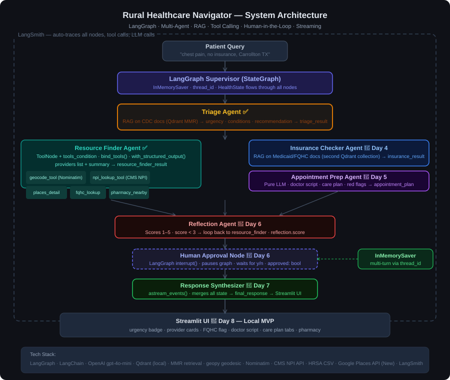

# 🏥 Rural Healthcare Navigator

> An AI-powered multi-agent system that helps rural patients understand symptoms,
> find nearby providers, check insurance eligibility, and prepare for doctor visits —
> running fully locally.

[](https://python.org)
[](https://github.com/langchain-ai/langgraph)
[](https://langchain.com)
[](https://qdrant.tech)
[](https://streamlit.io)
[](https://smith.langchain.com)

---

## Architecture



---

## Technology Stack

| Layer | Technology | Purpose |
|---|---|---|
| **Orchestration** | LangGraph StateGraph | State machine, node routing, InMemorySaver multi-turn memory |
| **Agent framework** | LangChain | `@tool`, `bind_tools()`, `with_structured_output()`, `ToolNode`, `tools_condition` |
| **LLM** | OpenAI `gpt-4o-mini` | All agents — structured output via Pydantic |
| **Vector DB** | Qdrant (local) | CDC symptom docs — MMR retrieval (fetch_k=20, k=5) |
| **Embeddings** | OpenAI `text-embedding-3-small` | Document + query embedding |
| **Document loading** | LangChain WebBaseLoader | Live CDC URLs — no PDF download needed |
| **Geocoding** | Nominatim (geopy) | Free, no API key — reverse geocoding for city/state |
| **Distance** | geopy geodesic | WGS-84 ellipsoid — more accurate than Haversine |
| **Provider lookup** | CMS NPI Registry API | Free federal API — 17 specialty taxonomy codes |
| **Places** | Google Places API (New) | Ratings, reviews, hours, telehealth detection |
| **FQHC data** | HRSA CSV (cached locally) | Sliding scale eligibility check |
| **Pharmacy** | Google Places API (New) | Nearest pharmacy to top provider |
| **Memory** | LangGraph InMemorySaver | Multi-turn via thread_id |
| **Observability** | LangSmith | Auto-traces all nodes + tool calls |
| **UI** | Streamlit | Local web UI (Day 8) |

---

## HealthState — Shared State

```python
class HealthState(TypedDict, total=False):
    user_query:             str    # original patient query
    symptoms:               str
    location:               str
    insurance:              str
    thread_id:              str    # InMemorySaver session ID

    triage_result:          Dict   # {urgency, reasoning, conditions, recommendation}
    resource_finder_result: Dict   # {providers: [...], summary: str}
    insurance_result:       Dict   # Day 4
    appointment_plan:       Dict   # Day 5
    reflection:             Dict   # Day 6 {score, notes}
    approved:               bool   # Day 6
    final_response:         str    # Day 7
```

---

## Project Structure

```
rural-healthcare-navigator/
├── src/backend/
│   ├── agents/
│   │   ├── triage_agent.py              ✅ RAG on CDC docs
│   │   ├── resource_finder_agent.py     ✅ 5 tools + structured output
│   │   ├── insurance_agent.py           🔲 Day 4 stub
│   │   ├── appointment_prep_agent.py    🔲 Day 5 stub
│   │   ├── reflection_agent.py          🔲 Day 6 stub
│   │   ├── human_approver_agent.py      🔲 Day 6 stub
│   │   └── synthesizer_agent.py         🔲 Day 7 stub
│   ├── graph/
│   │   └── supervisor.py                ✅ StateGraph + InMemorySaver
│   ├── rag/
│   │   ├── ingestion.py                 ✅ WebBaseLoader + chunking
│   │   ├── vectorstore.py               ✅ Qdrant create/load (lazy embeddings)
│   │   ├── retriever.py                 ✅ MMR retriever (lru_cache)
│   │   ├── medical_rag.py               ✅ RAG chain (built inside function)
│   │   └── populate_vectorstore.py      ✅ one-time ingestion script
│   ├── state/
│   │   └── health_state.py              ✅ HealthState TypedDict
│   ├── tools/
│   │   ├── geocoding.py                 ✅ Nominatim + USA fix + reverse geocoding
│   │   ├── npi_lookup.py                ✅ CMS NPI + geodesic distance
│   │   ├── places_detail.py             ✅ Google Places API (New)
│   │   ├── fqhc_lookup.py               ✅ HRSA CSV local cache
│   │   └── pharmacy_nearby.py           ✅ Google Places API (New)
│   ├── tests/                           ✅ per-file test coverage
│   ├── docs/
│   │   ├── plan.md                      ✅ 10-day build plan
│   │   └── agents.md                    ✅ agent reference
│   └── run.py                           ✅ CLI entrypoint
├── architecture.svg
├── requirements.txt
├── .env.example
└── README.md
```

---

## How to Run

### 1. Clone + setup
```bash
git clone https://github.com/amohan601/rural-healthcare-navigator.git
cd rural-healthcare-navigator
python -m venv .venv && source .venv/bin/activate
pip install -r requirements.txt
```

### 2. Configure .env
```env
OPENAI_API_KEY=sk-...
GOOGLE_PLACES_API_KEY=...
LANGCHAIN_TRACING_V2=true
LANGCHAIN_API_KEY=ls__...
LANGCHAIN_PROJECT=rural-healthcare-navigator
QDRANT_PATH=./qdrant_data
```

### 3. Populate Qdrant (one time)
```bash
python src/backend/rag/populate_vectorstore.py
```

### 4. Run CLI
```bash
python src/backend/run.py "I have chest pain in Carrollton TX no insurance"
python src/backend/run.py "I also have diabetes" --thread <thread-id>
```

### 5. Run tests
```bash
python src/backend/tests/test_supervisor.py
```

---

## Sample Queries

| Query | Urgency | Highlights |
|---|---|---|
| `"chest pain in Carrollton TX no insurance"` | 🔴 HIGH | FQHC sliding scale, nearby ER |
| `"cough 3 weeks BlueCross Austin TX"` | 🟡 MEDIUM | Pulmonologist, in-network |
| `"ankle sprain no insurance Dallas TX"` | 🟢 LOW | Urgent care, pharmacy nearby |

---

## Design Decisions

**Why LangGraph over AgentExecutor?**
StateGraph gives conditional edges, InMemorySaver checkpointing, and `interrupt()` for human-in-the-loop. AgentExecutor is a black box that hides the loop.

**Why ToolNode + tools_condition over manual loop?**
Cleaner graph — tools_condition replaces the `if response.tool_calls` check. ToolNode handles execution. The mini agent graph is explicit and traceable in LangSmith.

**Why two LLM calls in resource finder?**
`bind_tools()` and `with_structured_output()` are mutually exclusive. First call runs the tool loop. Second call extracts structured Pydantic output from the full conversation history.

**Why Qdrant over Chroma?**
Production-grade, HNSW indexing, used at scale. Local → cloud is one config change.

**Why MMR over similarity search?**
Fetches 20 candidates, returns 5 most diverse. Prevents near-identical chunks from same paragraph reducing LLM context quality.

**Why geopy geodesic over Haversine?**
Geodesic uses WGS-84 ellipsoid (how GPS works). Haversine assumes a perfect sphere — less accurate for longer distances.

**Why reverse geocoding for city/state?**
Nominatim returns structured address components via reverse lookup. Avoids brittle string parsing of display_name.

**Why HRSA CSV over their API?**
HRSA API doesn't return JSON reliably. CSV download is cached locally — one download, instant lookups.

**Why lru_cache on retriever?**
Without caching, every query reloads Qdrant from disk. With cache, loads once per process.

**Why chain inside function (medical_rag)?**
Module-level chain crashes on import if Qdrant not yet populated.

---

## Roadmap (MVP+1)

- [ ] Emergency node — HIGH urgency → direct ER routing
- [ ] Supervisor LLM node — dynamic agent routing
- [ ] True parallel execution via LangGraph Send API
- [ ] Qdrant Cloud — persistent cross-session memory
- [ ] RAGAS evaluation harness
- [ ] Spanish language support
- [ ] Appointment booking (Calendly API)
- [ ] AWS Lambda deployment

---

## Author

**Anju Mohan** — Data Pipeline Engineer · Georgia Tech MS Machine Learning
Transitioning to AI Engineering

[GitHub](https://github.com/amohan601) · [LinkedIn](https://linkedin.com/in/anju-mohan)
