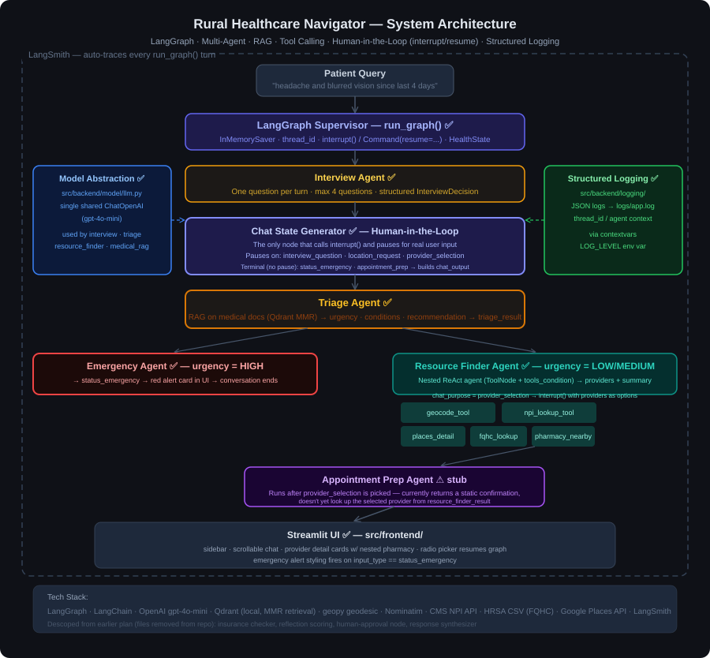
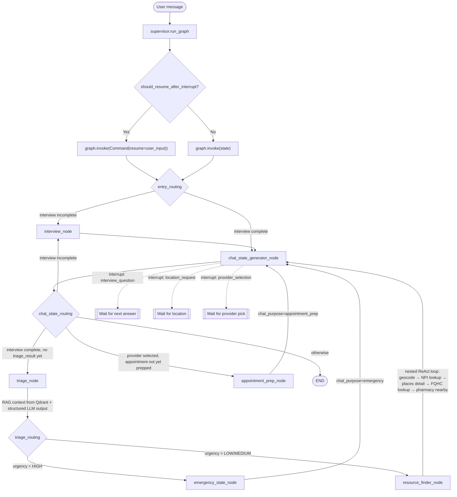
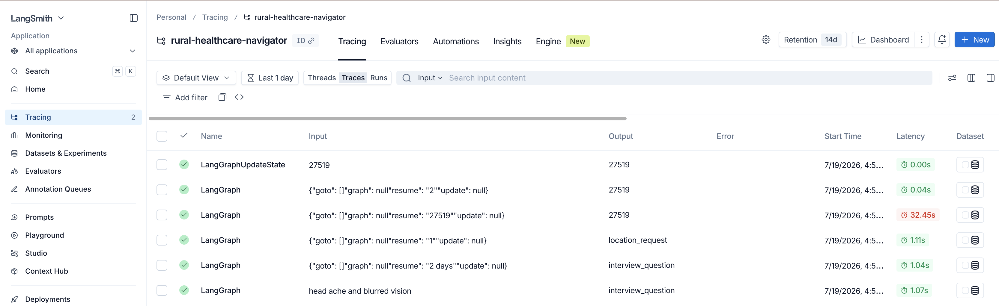

# 🏥 Rural Healthcare Navigator

AI-assisted rural care intake and routing system built with LangGraph, LangChain, Streamlit, and Qdrant.

## Current Architecture

The app runs as a chat-first, multi-agent workflow orchestrated by a single LangGraph state machine:

1. **Interview** collects symptom details one question at a time (structured LLM decision per turn: ask another question, or summarize and hand off to triage)
2. As soon as the interview is complete, the patient's **location** is requested — before triage runs, not after
3. **Triage** evaluates urgency (LOW / MEDIUM / HIGH) from the interview summary plus medical RAG context, and never diagnoses — only frames possible conditions
4. **HIGH urgency** routes straight to an emergency recommendation (`input_type=status_emergency`) and ends the conversation — the UI renders this as a distinct red alert card, not a plain chat bubble
5. **LOW/MEDIUM urgency** routes to the **resource finder**, a nested tool-calling agent that geocodes the patient, looks up nearby providers (NPI registry), enriches them with ratings (Google Places), FQHC/sliding-scale eligibility, and nearby pharmacies
6. The patient **selects a provider** from the enriched list
7. **Appointment prep** acknowledges the selection and ends the conversation (currently a stub — see Testing/Roadmap)



### LangGraph Flow (detailed routing)

The diagram above is the architecture overview; this is the precise routing logic behind it — including the `should_resume_after_interrupt` decision and the exact conditions each router function checks:


```mermaid
flowchart TD
    User([User message]) --> RunGraph[supervisor.run_graph]
    RunGraph --> Resume{should_resume_after_interrupt?}
    Resume -->|Yes| CmdResume["graph.invoke(Command(resume=user_input))"]
    Resume -->|No| Invoke["graph.invoke(state)"]

    CmdResume --> Entry
    Invoke --> Entry{entry_routing}

    Entry -->|interview incomplete| Interview[interview_node]
    Entry -->|interview complete| ChatState

    Interview --> ChatState[chat_state_generator_node]

    ChatState --> ChatRoute{chat_state_routing}
    ChatRoute -->|interview incomplete| Interview
    ChatRoute -->|interview complete, no triage_result yet| Triage[triage_node]
    ChatRoute -->|provider selected, appointment not yet prepped| Appointment[appointment_prep_node]
    ChatRoute -->|otherwise| End([END])

    Triage -->|RAG context from Qdrant + structured LLM output| TriageRoute{triage_routing}
    TriageRoute -->|urgency = HIGH| Emergency[emergency_state_node]
    TriageRoute -->|urgency = LOW/MEDIUM| ResourceFinder[resource_finder_node]

    Emergency -->|chat_purpose=emergency| ChatState
    ResourceFinder -->|"nested ReAct loop: geocode → NPI lookup →\nplaces detail → FQHC lookup → pharmacy nearby"| ChatState
    Appointment -->|chat_purpose=appointment_prep| ChatState

    ChatState -.->|interrupt: interview_question| Pause1[[Wait for next answer]]
    ChatState -.->|interrupt: location_request| Pause2[[Wait for location]]
    ChatState -.->|interrupt: provider_selection| Pause3[[Wait for provider pick]]
```

`chat_state_generator_node` is the graph's **human-in-the-loop** node — the single point where execution pauses for user input, and the only node that ever calls `interrupt()`. `emergency` and `appointment_prep` produce terminal, non-interrupting status messages (`input_required=False`) that flow straight through to `END` on the next routing pass.

## State, UI Conversation, and Resume Behavior

This project uses **LangGraph + InMemorySaver** to keep conversation state by `thread_id`, with real human-in-the-loop pausing via `interrupt()` / `Command(resume=...)` — not just re-invocation against a re-loaded checkpoint.

- Every UI submit calls `run_graph(most_recent_user_input, thread_id)`
- Supervisor loads prior state with `graph.get_state(thread_config)`
- If the prior turn ended on an `interrupt()`, the next call resumes the *exact* suspended node via `graph.invoke(Command(resume=most_recent_user_input))`
- Otherwise, the supervisor does a normal `graph.invoke(state)`, which runs synchronously through any number of non-interrupting nodes (e.g. `triage → emergency → chat_state → END` all happen inside a single call once the interview is done)
- Supervisor writes `chat_output` and persists state with `graph.update_state(...)`

### `chat_output` contract (generic UI)

`chat_output` is the only state the UI needs for next-step behavior:

```python
{
  "input_required": bool,
  "input_type": (
      "interview_question" | "location_request" | "provider_selection"
      | "status_emergency" | "status_update"
  ),
  "question": str | None,
  "display_message": str | None,
  "options": list,   # populated for provider_selection — enriched ProviderDetail objects
}
```

This keeps Streamlit generic and decoupled from internal `HealthState` fields. The Streamlit UI renders `provider_selection` specially: full provider + nested pharmacy detail cards, with a radio picker that resumes the graph with the selected list index.

## Resource Finder — Nested Tool-Calling Agent

`resource_finder_node` is itself a small LangGraph agent (`StateGraph(MessagesState)`) embedded inside the outer supervisor graph, following a standard ReAct tool-loop:

1. `geocode_tool` — patient location → lat/lon
2. `npi_lookup_tool` — CMS NPI Registry search by specialty + city/state, sorted by geodesic distance
3. `places_detail_tool` — enriches each provider with Google Places rating, review count, hours, telehealth flag
4. `fqhc_lookup_tool` — flags FQHC / sliding-scale eligibility (prioritized for uninsured patients)
5. `pharmacy_nearby_tool` — nearest pharmacy per provider

The loop runs via `tools_condition` until the LLM stops requesting tools, then a **second, structured-output LLM call** converts the raw tool-call transcript into a typed `ResourceFinderOutput` (list of `ProviderDetail`, each with a nested `PharmacyDetail`) — separating "gather evidence" from "produce the typed answer."

## Qdrant Usage

Qdrant is used as the local vector store for symptom triage retrieval.

- Embeddings: `text-embedding-3-small`
- Retrieval: MMR
- Collection is populated via ingestion scripts under `src/backend/rag/`
- Triage node consumes RAG context before producing urgency/conditions/recommendation

## Model Abstraction

All LLM access goes through a single shared instance in `src/backend/model/llm.py` rather than each agent constructing its own `ChatOpenAI`. `triage_agent`, `interview_agent`, `resource_finder_agent`, and `medical_rag` all import the same `LLM` object. This is the seam that would let a provider (e.g. Azure OpenAI) or model swap happen in one file instead of four.

## Structured Logging

`src/backend/logging/` replaces ad-hoc `print()` debugging with structured, JSON-formatted logs:

- `logger.py` — a single named logger (`rural_health`), level controlled by the `LOG_LEVEL` env var, writing to `logs/app.log`
- `formatter.py` — `JsonFormatter` emits one JSON object per line (`timestamp`, `level`, `thread_id`, `agent`, `message`, `module`, `function`, `line`)
- `context.py` — `contextvars`-based `thread_id_var` / `agent_var` so log lines can be correlated back to a specific conversation and agent without threading those values through every function call

Adopted across the graph nodes, routing functions, and RAG/model layers.

## Observability

LLM calls and agent runs are traced with **LangSmith** (`LANGCHAIN_TRACING_V2`, `LANGCHAIN_API_KEY`, `LANGCHAIN_PROJECT` in `.env`), giving per-run visibility into prompts, structured outputs, and the tool-calling loop inside the resource finder agent.



The trace list above shows real conversation turns against the deployed graph: `LangGraphUpdateState`/`LangGraph` runs carrying the `Command(resume=...)` payloads (e.g. a provider-selection resume of `"2"`, a location resume) alongside latency per turn. Traces are currently one span per `run_graph` invocation — breaking each span down into per-node (interview/triage/resource_finder/etc.) child spans is still on the roadmap below.

## Frontend

The Streamlit UI lives under `src/frontend/` and is split by concern rather than being a single script:

- `app.py` — page config, top-level routing between "waiting for input" / "processing" / "new conversation" states, calls `run_graph`
- `ui/state.py` — session-state initialization
- `ui/sidebar.py` — static app description / capabilities panel
- `ui/chat.py` — scrollable chat history, `chat_output` → display-text formatting, auto-scroll
- `ui/providers.py` — provider selection: full detail cards (specialty, address, rating, hours, FQHC/sliding-scale/telehealth flags, nested pharmacy) with a radio picker that resumes the graph with the selected index
- `ui/alerts.py` — urgency-styled alert components (emergency / warning / info); `render_emergency_alert` is wired into `ui/chat.py`'s history renderer and fires whenever `chat_output.input_type == "status_emergency"`
- `ui/styles.py` — shared CSS

## Testing

`src/backend/tests/` currently covers, at the level of pytest-runnable, non-commented tests:

- `test_supervisor.py` — the compiled graph exposes the expected node set (`interview`, `chat_state`, `triage`, `emergency`, `resource_finder`, `appointment`), and a live `run_graph` call returns a well-formed `{"chat_output": ...}` dict
- Per-tool/per-agent smoke tests (`test_triage_agent.py`, `test_resource_finder_agent.py`, `test_interview_agent.py`, `test_retriever.py`, `test_fqhc_lookup.py`, `test_npi_lookup.py`, `test_places_detail.py`, `test_pharmacies_nearby.py`, `test_geocoding.py`, `test_ingestion.py`, `test_medical_rag.py`)

This is smoke-test-level coverage (does it run, does the shape look right), not edge-case coverage of the routing logic — see Roadmap.

## Roadmap

Planned hardening, roughly in priority order:

- [ ] Unit tests for `_chat_state_routing` / `_triage_routing` edge cases (empty/first-index provider selections, terminal-state loop guards) — not covered by the current smoke tests
- [ ] A small labeled eval set for the triage agent (symptom → expected urgency) with agreement/precision scoring
- [ ] Full per-node LangSmith tracing tags + run metadata (thread_id, chat_purpose) so a single conversation's spans are broken down by node, not one opaque span per turn
- [ ] Route the model abstraction through Azure OpenAI as a selectable provider, not just OpenAI directly
- [ ] Dockerfile + docker-compose (app + Qdrant) and a CI workflow running tests/lint on push
- [ ] Neo4j-backed graph of provider/pharmacy/condition relationships as an alternative to pure vector retrieval for resource matching

## Quick Run

```bash
pip install -r requirements.txt
streamlit run src/frontend/app.py
```

Optional API mode:

```bash
uvicorn src.backend.main:rural_navigator_app --reload
```
